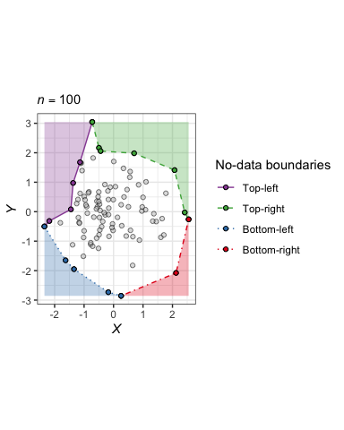
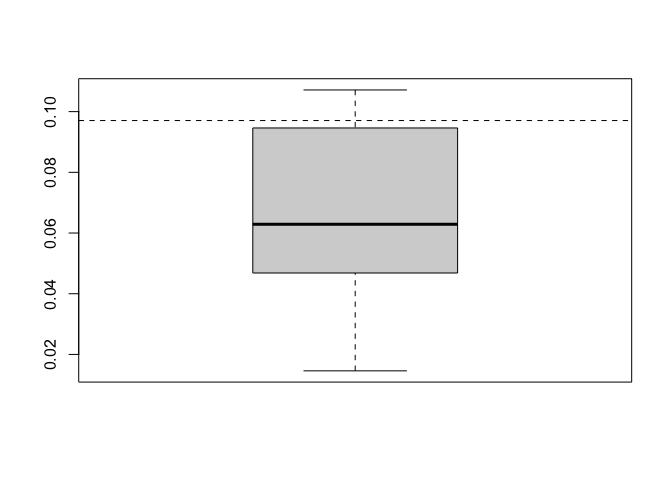
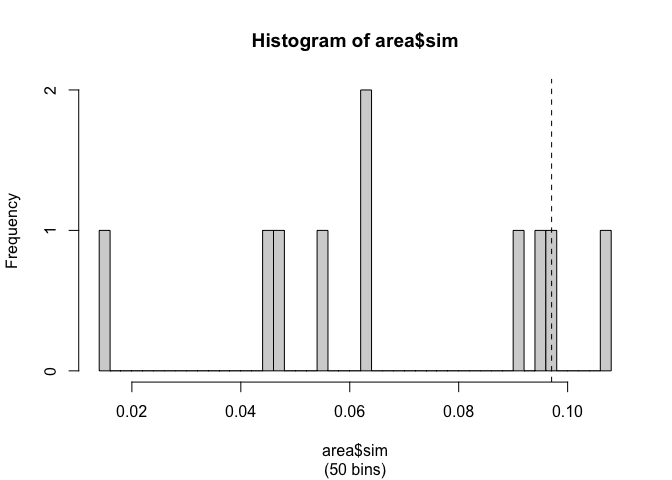

Let us consider some simulated data, where both *X* and *Y* follow a
standard normal distribution — i.e.  ∼ *N*(*μ*=0,*σ*=1). Simulating 100
points, the ‘boundaries’ of this data set look like this:

(Figure generated by mostly `sobir`.)

Now let’s run the permutations. For the sake of time, I’ll permute the
data (without replacement) 10 times:

    perm_area_result <- perm_area(xdat, ydat, nsim = 10)
    perm_area_result

    ## $n
    ## [1] 100
    ## 
    ## $nsim
    ## [1] 10
    ## 
    ## $p
    ## [1] 0.2727273
    ## 
    ## $data
    ##    polygon        val source   rescale
    ## 21    topl 0.01459175    sim 0.0000000
    ## 22    topl 0.06337888    sim 0.3106335
    ## 23    topl 0.04409965    sim 0.1878803
    ## 24    topl 0.04682727    sim 0.2052475
    ## 25    topl 0.09461818    sim 0.5095379
    ## 26    topl 0.06239737    sim 0.3043841
    ## 27    topl 0.09135368    sim 0.4887524
    ## 28    topl 0.05456549    sim 0.2545176
    ## 29    topl 0.10713905    sim 0.5892597
    ## 30    topl 0.09648960    sim 0.5214534
    ## 43    topl 0.09705856    obs 0.5250761

Note, the *p*-value (of the observed magnitude of the area of the
top-left no-data zone) here is that calculated by the R-package
`statmod`. Disregard that for now. For the time being, I’d like to
intuit what I think calculating *Z*-statistic would look like in this
situation.

There are two approaches to *Z* in my mind: i) the difference between
the observed area and mean of the permuted areas and ii) the rank of the
observed area among the permuted areas.

First, let’s look at the means-method:

    z <- (obs_area - mean(perm_areas))/sd(perm_areas)
    z

    ## [1] 1.00894

    pnorm(z, lower.tail = FALSE)

    ## [1] 0.1565016

Second, let’s look at the rank-method (which is non-parametric, unlike
the first method which assumes the permuted areas follow a normal
distribution (I’m not saying they don’t, I’m just saying I’m not 100%
sure they always will)):

    ranks <- rank(c(obs_area, perm_areas))
    # We want the "p-value" for the 11th ranking value out of 11 values to be 1/11 (= ~0.091)
    # Hence:
    (length(ranks) - ranks[[1]] + 1)/length(ranks)

    ## [1] 0.1818182

In mathematical notation, if the observed area *a*obs ranks
11th (i.e. greatest) out of the set of 11 areas *a*
( = {*a*obs, {*a*perm}}), we *want* the
“*p*-value” here, conceptually, to equal $\frac{1}{11}$ (= 0.091). So,

$$
  p = \frac{1}{11} = \frac{11 - 11 + 1}{11} \approx 0.091
$$

More generally, for *n*perm permuted areas, the “*p*-value”
for *a*obs is based on its rank *r*obs among the
permuted areas:

$$
  p(a\_\mathrm{obs}|a\_\mathrm{perm}) = \frac{(n\_\mathrm{perm} + 1) - r\_\mathrm{obs} + 1}{n\_\mathrm{perm} + 1}
$$

    perm_area_result$data %>%
      ungroup() %>%
      arrange(val) %>%
      mutate(rank = rank(val)) %>%
      mutate(extremity = ifelse(rank <= ceiling(n()/2),
        n() - rank,
        rank
      )) %>%
      mutate(p_twosided = (n() - extremity + 1)/n()) %>%
      data.frame()

But I digress.

    area <- perm_area_result$data %>%
      split(.$source) %>%
      map(pull, val)

    boxplot(area$sim)
    abline(h = area$obs, lty = "dashed")

    hist(area$sim, breaks = 50, sub = "(50 bins)")
    abline(v = area$obs, lty = "dashed")

